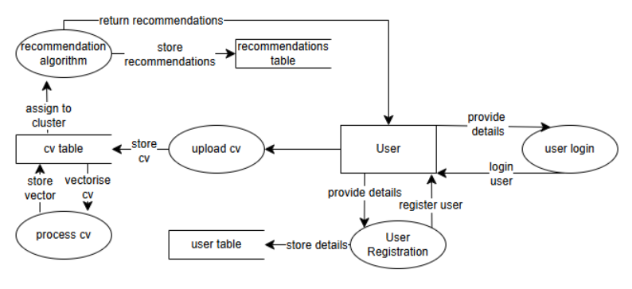
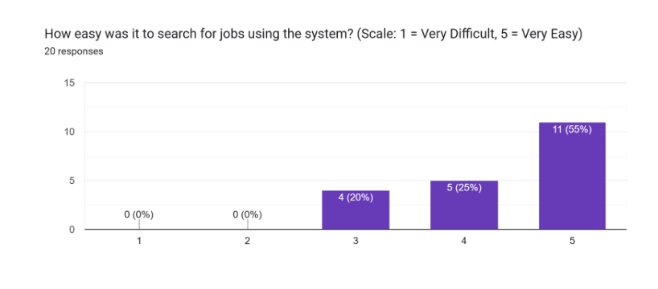

# **Technical Specifications**

Student 1: Alexander Yakushenko
Student 2: Mahmoud Yousif

# **Table of Contents**  

## **1. Introduction**  
- [1.1 Overview](#11-overview)  
- [1.2 Glossary](#12-glossary)  

## **2. System Architecture**  
- [2.1 Tech Stack](#21-tech-stack)  
  - [Backend](#backend)  
  - [Frontend](#frontend)  
  - [Other Tools](#other-tools)  
- [2.2 System Context](#22-system-context)  
- [2.3 Component Model](#23-component-model)  
  - [Frontend](#frontend)  
  - [Backend](#backend)  
  - [Search Engine](#search-engine)  
  - [CV Processing](#cv-processing)  
  - [Clustering & Recommendation](#clustering--recommendation)  
- [2.4 System Architecture](#24-system-architecture)  

## **3. High-Level Design**  
- [3.1 Features](#31-features)  
- [3.2 Sitemap](#32-sitemap)  
- [3.3 Database Design](#33-database-design)  
  - [3.3.1 Entity Relationship Diagram](#331-entity-relationship-diagram)  
  - [3.3.2 Data Flow in the System](#332-data-flow-in-the-system)  
  - [Processes and Data Flow](#processes-and-data-flow)  
- [3.4 Class Diagram](#34-class-diagram)  

## **4. Problems and Resolutions**  
- [4.1 CV Recommendation System](#41-cv-recommendation-system)  
  - [Problem](#problem)  
- [4.2 Improving Search Performance](#42-improving-search-performance)  
  - [Problem](#problem-1)  
  - [Solution](#solution)  

## **5. Testing & Validation**  
- [5.1 Git & CI/CD Usage](#51-git--ci-cd-usage)  
- [5.2 Unit Testing](#52-unit-testing)  
- [5.3 Integration Testing](#53-integration-testing)  
- [5.4 UI Testing](#54-ui-testing)  
- [5.5 User Testing](#55-user-testing)  

## **6. Installation Guide**  
- [6.1 Installation Steps](#61-installation-steps)  

## 1.1 Overview

The **OpportuNext** system is a web based job recommendation platform designed to help job seekers find relevant opportunities by analyzing their CVs. It groups similar job postings together and suggests positions that closely match a user’s skills and experience.Along with automated recommendations, the system allows users to search for jobs manually. It quickly retrieves job postings based on keywords. A built-in auto-suggestion feature helps users refine their search by offering job title recommendations as they type.

Users can upload their CVs, and the system processes the information to identify the most suitable job categories. Based on this, personalized job recommendations are generated and saved for easy access at any time.OpportuNext also supports user accounts, enabling individuals to sign up, log in, and manage their profiles. They can update their CVs and receive job recommendations tailored to their most recent career focus. The platform is designed to be fast, user-friendly, and intuitive, making the job search experience as efficient as possible.

**Motivation**

The main motivation for developing the OpportuNext platform was to improve job search experience by addressing common challenges faced by job seekers.

1. **Solving the Cold Start Problem**Traditional job platforms often struggle to provide relevant recommendations for new users due to the lack of prior data. Opportunext overcomes this by analysing a users’s CV immediately upon upload, ensuring they receive meaningful job suggestions from the start.
2. **On-Demand Recommendations**Many job platforms send frequent recommendation email that can feel intrusive and overwhelming. Instead, OpportuNext provides recommendations only when the users want them, allowing them to access job matches at their convenience.
3. **Context-Aware Recommendations**
   Job seekers often update their CVs over time, whether they are tailoring it for different roles, switching careers, or highlighting new skills. OpportuNext ensures that recommendations are always based on the relevant version of the user’s CV, making job suggestions more relevant to their current career goals.

## 1.2 Glossary

| Term                                      | Description                                                                                                       | References |
|-------------------------------------------|-------------------------------------------------------------------------------------------------------------------|------------|
| **Django REST Framework**                 | A powerful toolkit for building Web APIs with Django, a high-level Python web framework.                          | [Django REST Framework](https://www.django-rest-framework.org/) |
| **Elasticsearch**                          | A search engine that provides fast and scalable keyword-based search capabilities.                                | [Elasticsearch Guide](https://www.elastic.co/guide/en/elasticsearch/reference/current/index.html) |
| **Tech Stack**                             | The collection of technologies, frameworks, and tools used to build and run an application.                       | [Tech Stack Explained](https://codeinstitute.net/ie/blog/tech-stack-meaning-examples-explanations/) |
| **Vector**                                 | A numerical representation of data, often used to capture features of text or other information in machine learning. | [Vectors in ML](https://www.algolia.com/blog/ai/what-are-vectors-and-how-do-they-apply-to-machine-learning) |
| **Similarity**                             | A measure of how alike two pieces of data are, typically calculated using mathematical or statistical methods.    | [Similarity Learning](https://bigblue.academy/en/similarity-learning) |
| **Vectorization**                          | The process of converting data (such as text) into numerical vectors for machine learning algorithms.              | [Vectorization Guide](https://medium.com/@kaushikvikas/understanding-vectorization-applications-benefits-and-future-trends-d45b8798fa1e) |
| **Clustering Algorithm**                   | A machine learning technique that groups similar data points together, e.g., K-Means, K-Medoids, and CLARANS.     | [Clustering Algorithms](https://developers.google.com/machine-learning/clustering/clustering-algorithms) |
| **K-Means**                                | A clustering algorithm that partitions data into K clusters based on feature similarity.                          | [K-Means Clustering](https://www.geeksforgeeks.org/k-means-clustering-introduction/) |
| **K-Medoids Clustering**                   | Similar to K-Means but uses actual data points (medoids) as cluster centers, making it more robust to outliers.   | [K-Medoids Clustering](https://www.tpointtech.com/k-medoids-clustering-theoretical-explanation) |
| **CLARANS**                                | A clustering method designed for large datasets but may not scale well in some cases.                             | [CLARANS Algorithm](https://haifengl.github.io/api/kotlin/smile-kotlin/smile.clustering/clarans.html) |
| **N×N Similarity Matrix**                  | A square matrix that holds similarity scores between every pair of items.                                         | [Similarity Matrix](https://www.sciencedirect.com/topics/computer-science/similarity-matrix) |
| **SBERT (Sentence-BERT)**                  | A modification of the BERT model that produces semantically meaningful sentence embeddings.                        | [SBERT](https://sbert.net/) |
| **PyPDF2 / pdfplumber**                     | Python libraries for extracting text and other content from PDFs.                                                 | [PyPDF2](https://pypi.org/project/PyPDF2/) [PDF to Text](https://medium.com/@tam.tamanna18/pdf-to-text-extraction-42e1da56c4d1) |
| **Fuzzy Matching**                         | A technique that finds approximate matches in text data, allowing for typos and variations.                       | [Fuzzy Matching Guide](https://nanonets.com/blog/fuzzy-matching-fuzzy-logic/) |
| **CORS (Cross-Origin Resource Sharing)**   | A browser security feature restricting web pages from making requests to a different domain.                      | [CORS Explained](https://aws.amazon.com/what-is/cross-origin-resource-sharing/) |
| **django-cors-headers**                    | A Django package that simplifies configuring CORS settings for secure cross-domain requests.                      | [Django CORS Guide](https://www.stackhawk.com/blog/django-cors-guide/) |
# 2\. System Architecture

The OpportuNext system follows a modular architecture that separates concerns between data processing, search, user management, and job recommendations. It consists of a backend API that handles data processing and logic, a frontend application for user interaction, and an Elasticsearch engine for efficient job searches.

## 2.1 System Overview

***Figure 1 \- System Overview Diagram***

### **1\. Front-End**

* **User Interaction:**
  * The user interacts with the React Vite front-end to perform actions like logging in, searching for jobs, and uploading a CV.
  * The front-end is responsible for sending HTTP requests (GET, POST, etc.) to the Django REST API and receiving JSON responses.
* **Technologies:**
  * React Vite: Manages UI rendering and user interactions.
  * Tailwind CSS: Ensures responsive design and styling.
  * Framer Motion: Handles animations and UI transitions for better user experience.

### **2\. Back-End**

* **API & Business Logic:**
  * The Django REST Framework handles API requests for:
    * User authentication
    * CV processing
    * Job recommendations
* **Data Processing:**
  * Uses NumPy to handle job vectorization.
  * Scikit-learn performs K-Medoids clustering to group job embeddings.
  * SentenceTransformers (SBERT) converts job descriptions and CVs into vector representations for similarity matching.
* **Data Flow:**
  * Extracted CV text is sent to the ML pipeline for vectorization.
  * The system stores and retrieves job data from SQLite.
  * Elasticsearch is queried for job searches.

### **3\. Database & Search**

* **SQLite (Development Database):**
  * Stores:
    * User data
    * Uploaded CVs
    * Job recommendations
    * Clustering information
  * The backend reads job clusters from SQLite to improve recommendations.
* **Elasticsearch (Search Engine):**
  * Provides fast and scalable job search capabilities.
  * The backend queries Elasticsearch when a user searches for jobs.
* **Data Flow (Database & Search Layer):**
  * Backend reads/writes user and job data to SQLite.
  * Backend queries Elasticsearch when a user searches for jobs.

### **4\. Other Tools**

* **PyPDF2 / pdfplumber:**
  * Extracts text from uploaded CV PDFs.
  * The extracted text is sent to the backend and ML pipeline for further processing.
* **SBERT (Sentence-BERT):**
  * Converts job descriptions and CVs into numerical vector representations.
  * Helps in job matching and similarity scoring.
* **K-Medoids Clustering:**
  * Groups job postings into clusters to improve recommendation efficiency.
  * Stores clustered job data in SQLite for fast retrieval

## 2.2 System Context

***Figure 2 \- System context design***

The **OpportuNext** system consists of three primary components:

1. **Frontend (React.js)**
   * Users can upload their CV, view job recommendations, manually search for jobs, and manage their accounts.
   * Interacts with the backend API to send and retrieve data.
2. **Backend (Django REST API)**
   * Handles CV processing, clustering, and recommendation generation.
   * Stores user profiles and job recmmendations in the database.
   * Communicates with Elasticsearch to handle job search queries.
3. **Search Engine (Elasticsearch)**
   * Enables fast keyword-based searching.

## 2.3 Component Model

***Figure 3 \- Component Model***

The system is divided into the following functional components:

* **User Management Module** – Handles authentication (signup/login) and user profile updates.
* **CV Processing Module** – Extracts text from PDFs and converts it into a vector representation.
* **Clustering & Recommendation Module** – Assigns CVs to clusters and retrieves the most relevant job postings.
* **Search System (Elasticsearch)** – Allows users to search for jobs using **keywords and fuzzy matching**.
* **Frontend Interface** – Displays recommendations, search results, and manages user interactions.

This component diagram provides a high-level view of the functional components within the OpportuNext system. It illustrates the main modules and their interactions using UML notation, including provided and required interfaces.

### **Frontend**

* Handles user interactions, including CV uploads, job searches, and displaying recommendations.
* Requires an API service from the backend.

### **Backend**

* Acts as the central processing unit for API requests, CV processing, job recommendations, and search queries.
* Provides an API service to the frontend.
* Requires services from other components:
  * Search Service from the Search Engine
  * CV Processing for text extraction and vectorization
  * Clustering & Recommendation for assigning CVs to clusters and retrieving job matches

### **Search Engine**

* Provides the search service for job postings using Elasticsearch.
* The backend uses this service for manual job searches.

### **CV Processing**

* Extracts text from uploaded CVs and converts them into vector representations.
* Provides the vector output needed for clustering.
* Triggered by the Backend when a user uploads their CV.

### **Clustering & Recommendation**

* Groups job postings into clusters and retrieves relevant job recommendations.
* Uses the vector output from CV Processing to assign the CV to the most relevant cluster.
* Backend retrieves recommendations from this module.

## **2.4 System Architecture**

***Figure 4 \- System architecture Diagram***

This diagram provides a high-level overview of the **OpportuNext** system architecture. It illustrates the main components and how they interact to provide job recommendations and search functionality.

1. **User** – Interacts with the system by uploading CVs, searching for jobs, and viewing recommendations.
2. **Web Application** – The frontend interface built using React.js. It handles user interactions and communicates with the Backend via API requests.
3. **Backend** – The central processing unit that manages API requests, CV processing, job recommendations, and search queries. It also communicates with the Database, **Search** Engine, and Recommendation Engine.
4. **Recommendation Engine** – Analyzes CVs, groups job postings into clusters, and generates personalized job recommendations.
5. **Search Engine** – Powered by Elasticsearch, it handles manual job searches and provides fast, keyword-based retrieval.
6. **Database** – Stores user profiles, CVs, job postings, and job recommendations, ensuring data persistence and quick retrieval.

This architecture design ensures modularity, scalability, and efficient data flow, enabling real-time job recommendations and responsive search functionality.

## **2.5 Recommendation Engine**

The Recommendation Engine in OpportuNext plays a crucial role in matching users with job opportunities that are most relevant to their skills and experience. This part of the system is based on a clustering algorithm that leverages SBERT vectorisation and cosine similarity to generate personalized recommendations.

### **2.5.1 Design Considerations**

**Efficiency**
The reason for choosing a clustering algorithm in the first place is to reduce computational time required for processing and generating recommendations. Since the dataset contains over 60,000 job entries it would take too long to compute similarity of the CV to each job. Breaking up the dataset into clusters, cuts down on computational complexity, ensuring that a CV is first matched with the most relevant cluster, so that it can be compared to a fraction of the dataset while still providing accurate recommendations

**Accuracy**
We wanted to ensure the most accurate recommendations possible, so for that we needed to choose an appropriate clustering algorithm. The two algorithms we had in mind were K means and K medoids. While very similar they have their pros and cons. The main upside of K means was it’s speed and simplicity. On the other hand K medoids is slower, and requires a lot of RAM for training as it needs to store a complete distance matrix of size **n x n** which in our case would be 60 000 x 60 000\. We did however end up going with K medoids due to it’s robustness against outliers and noise.

**Text Representation**

One of the major decisions we faced was how to represent the text (job descriptions and CVs) for the purpose of similarity comparison. There were three primary approaches we considered:

1. **Keyword Matching:** This is the simplest approach, where we would extract keywords from job descriptions and CVs and compare them based on frequency. While efficient, this approach fails to capture the semantic meaning behind the text, leading to potentially inaccurate matches.
2. **SBERT Embeddings:** One of the options we considered was SBERT (Sentence-BERT), which generates vector embeddings that capture the semantic meaning of text. SBERT converts text into high-dimensional vectors, allowing for comparisons based on overall meaning.This approach offers the potential for more accurate and context-aware recommendations.
3. **Generative Solution (OpenAI API):** An alternative we considered was using a generative solution like the OpenAI API to convert both the CV and job description into a summarized sentence that captures the most important information. We could then compute similarity using a semantic similarity metric.

Ultimately, we opted for SBERT embeddings because it provides the right balance between accuracy and efficiency. Unlike keyword matching, SBERT understands the context of words and generates vector representations that can more accurately compare CVs and job descriptions, without the added complexity and costs of generative models.

### **2.5.2 Core Components**

**SBERT**
It’s a model that generates vector embeddings for text, capturing their semantic meaning. It is based on a pre-trained transformer mode. It works by producing a 384 dimensional vector, which are numerical representations of given text.
We utilised the sentence-transformers library, which provides a straightforward API for using the model.
Example Usage:

from sentence\_transformers import SentenceTransformer
model \= SentenceTransformer('all-MiniLM-L6-v2')
vector \= model.encode("This is a job description")

**K-Medoids Clustering**
A clustering algorithm that groups data points into clusters by selecting medoids ( representative points ) that are the most centrally located in each cluster. Unlike K-Means, which calculates centroids as the mean of all points in a cluster, K-Medoids uses actual data points as cluster centres.
We opted for the sklearn\_extra library, which provides an implementation of the K-Medoids algorithm.
Example Usage:

from sklearn\_extra.cluster import KMedoids
kmedoids \= KMedoids(n\_clusters=5, random\_state=42).fit(job\_vectors)

**Cosine Similarity**
A metric used to determine the similarity between two vectors by measuring the cousin of the angle between them. The closer the value is to 1, the more similar they are.
We used the provided method in the scikit-learn library.
Example Usage:

from sklearn.metrics.pairwise import cosine\_similarity similarity\_score \= cosine\_similarity(cv\_vector, job\_vector)

### **2.5.3 Overview of the Process**

At run time, the recommendation algorithm runs in the following steps.

1. **Vectorisation**Upon cv upload, the text is extracted from the pdf and converted into a high dimensional vector using Sentence-BERT (SBERT). These vectors represent the content of the CV in a comparable format, while maintaining the semantic meaning.
2. **Similarity Calculation**Once the CV is vectorised, the vector is compared against the precomputed cluster medoids using the cosine similarity metric. The CV is assigned to the cluster, which medoid vector is most similar to the CV vector. The CV is then compared against every job in that cluster.
3. **Recommendation Generation**
   The jobs vectors that are most similar to the CV vector are then returned to the user as recommendations, displaying the best matches first.

### **2.5.4 Implementation Stages**

1. **Data Preprocessing**The first stage involved data preprocessing, where we transform job descriptions into their vector representations using the SBERT model. We then updated the Job table in the database to store the vectors.
2. **Elbow Method**
   After vectorising, we need to decide on the number of clusters to divide the dataset into. This is done using the elbow method to determine the optimal number of clusters (k).

* The Elbow Method calculates the within-cluster sum of squares (WCSS) for different values of k. As k increases, WCSS decreases since data points are divided into more clusters. However, after a certain point, adding more clusters yields diminishing returns. The "elbow" is where this slowdown occurs, indicating the optimal number of clusters. Choosing k at the elbow balances efficiency and accuracy.

3. **Training**Once the optimal number of clusters is determined using the Elbow Method, we proceed to train the K-Medoids clustering algorithm. During training, the algorithm assigns each job to the closest cluster medoid based on the calculated pairwise distances.
4. **Updating the Database**After the clustering model is trained, we need to store the result in the database. This includes storing clusters and medoids
5. **Implementing the CV Upload Process**
   After we proceeded to implement the CV upload process with the functionality outlined in section 2.5.3

# 3\. High-Level Design

## **3.1 Features**

**User Authentication and Account Management**

* Users can create an account, log in, and manage their profile.
* Account management includes updating CVs and viewing saved job recommendations.

***Figure 5 \- Sequence diagram for logging in***

This sequence diagram illustrates the login process for a user interacting with a system. It begins when the user provides their login credentials (typically an email and password) via the frontend. These credentials are then sent to the backend, which processes the request. The backend first checks the database to determine whether the provided email exists. If the email is not found, an error message indicating "wrong credentials" is raised and returned to the frontend. If the email does exist, the backend proceeds to validate the password. If the password is incorrect, another "wrong credentials" error is raised and displayed to the user. However, if the email exists and the password is correct, the backend authenticates the user, and both the frontend and backend execute the login process, granting the user access to the system.

  ***Figure 6 \- Sequence diagram for registering as a new user***

This sequence diagram represents the user registration process. When a user submits their email and password through the frontend, the credentials are sent to the backend, which then checks the database to see if the email already exists. If the email is found, an "account exists" error is raised, notifying the user that they cannot proceed with registration. However, if the email is not in use, the backend stores the new credentials in the database and sends a confirmation message back to the frontend, which then notifies the user that their account has been successfully created. This process ensures that users cannot create duplicate accounts while allowing new users to register efficiently.

***Figure 7 \- Sequence diagram for updating user details***

The user begins by submitting new credentials (email and/or password) through the frontend, which then forwards the information to the backend. The backend first checks whether the submitted credentials are blank. If both fields are empty, an error is raised, notifying the user that no credentials were provided. If at least one field is filled, the backend updates the non-empty fields accordingly. If a new email is provided, it is stored in the database, followed by confirmation. Similarly, if a new password is submitted, it is securely stored. Once the updates are successfully processed, a confirmation is sent back to the frontend, which then notifies the user that their details have been updated. This process ensures that users can efficiently update their credentials while preventing empty submissions.

**CV Upload & Processing \+  Personalized Job Recommendations**

***Figure 8 \- Sequence diagram for uploading CV and recommendations generation***

This sequence diagram illustrates the CV upload and job matching process. The user begins by uploading their CV through the frontend, which then sends the file to the backend. The backend checks whether the uploaded file is a PDF. If the file is of the wrong type, an error is raised, and the user is notified that only PDFs are allowed. If the file is valid, the backend stores the CV in the database and confirms a successful upload. Next, the backend processes the CV by vectorizing its content and storing the generated vector representation. The system then retrieves medoids (representative vectors for clustering) and identifies the most similar medoid to the user's CV. Using this, the backend retrieves relevant job clusters and calculates similarities between the CV and available job listings. Finally, the system returns the top k best-matching jobs to the frontend, which then displays them to the user, helping them find the most suitable job opportunities.

* Users can upload their CVs in PDF format.
* The system extracts text from the uploaded CV and converts it into a vector representation.
* The CV is then assigned to the most relevant job cluster, ensuring accurate job recommendations.
* Based on the cluster assignment, the system generates a list of job recommendations most relevant to the user’s experience and skills.
* Recommendations are saved and can be accessed later.

**Manual Job Search**

***Figure 9 \- Sequence diagram for manual job search***

This sequence diagram represents the job search process within the system. The user starts by inputting a search query in the frontend, which then sends the query to the backend. The backend processes the request by retrieving job listings from the database that match the given query (e.g., jobs with a specific tag). If no jobs are found, an error is raised, notifying the user that the search did not return any results. However, if matching job listings are found, the backend sends the job list back to the frontend, which then displays the results to the user, helping them explore relevant job opportunities.

* Users can search for jobs manually using keywords.
* The search system supports fuzzy matching and real-time suggestions to enhance the search experience.
* Search results are ranked by relevance.

## **3.2 Sitemap**

***Figure 10 \- SiteMap***

This site map outlines the overall navigation and functional structure of our website, ensuring that users can quickly find the information they need, create an account, log in, and utilize core features such as uploading their CV and managing their account. The following points detail each main section of the site and how they interconnect.

* Our structure begins at the Home page, which introduces the site and offers navigation to the About section , the Sign-Up page , and the Login page (leading to the MainHome area for authenticated users).
* In MainHome, users can access Account Management , the Upload CV section to receive recommendations, and the Search section, with Search Results displayed accordingly.
* A Footer is present on each page containing contact information, etc.

## **3.3 Database design**

### 3.3.1 Entity Relationship Diagram

***Figure 11 \- ER Diagram***

This is the database design used for the OpportuNext platform. It illustrates the relationships between the main entities, including User, CV, Cluster, Job, and Recommendation. In this diagram, the Job table is shown in a collapsed form to save space, but the full structure with all attributes is displayed below for clarity.

**Figure 12 \- Jobs**

### 3.3.2 Data Flow in the System

This Data Flow Diagram (DFD) illustrates the movement of data within the OpportuNext system, detailing how user interactions result in data storage, processing, and retrieval. It includes the processes for User Registration, User Login, and CV Upload, highlighting how data flows between the User, Backend Processes, and Database Tables.

***Figure 13 \- Dataflow Diagram***

### **Processes and Data Flow**

1. **User Registration**
   * The user provides registration details (email, username, and password).
   * These details are sent to the User Registration process for validation and storage.
   * Once validated, the User Registration process stores the new user details in the User Table.
   * The user is then registered and can proceed to login.
2. **User Login**
   * The user provides login details (username and password).
   * The User Login process validates the credentials against the User Table.
   * If the credentials are valid, the user is authenticated and logged in.
3. **CV Upload and Processing**
   * The user uploads their CV, which is stored in the CV Table.
   * The Process CV module extracts text from the CV and vectorizes it.
   * The vectorized CV is assigned to the most relevant job cluster.
   * The Recommendation Algorithm processes the vector, generating personalized job recommendations.
   * These recommendations are stored in the Recommendations Table.
   * The recommendations are then retrieved and returned to the user.

## **3.4 Class Diagram**

**Figure 14 \- Class Diagram**

The Class Diagram illustrates the data models and their interactions within the OpportuNext system. It represents the main entities, including Users, CVs, Jobs, Clusters, and Recommendations, along with their attributes and methods. The Job entity in this diagram does not contain a complete list of attributes. For a complete list of attributes, refer to section 3.3.1This diagram visualises how the system components are connected and how data flows between them. It shows the methods responsible for processing CVs, vectorizing job descriptions, training clusters, and retrieving job recommendations.

# 4\. Problems and Resolution

## **4.1 CV Recommendation System**

#### **Problem**

The first challenge we encountered was the computational cost it would take to compare a users’ CV to every job posting in the dataset. Calculating similarity across the entire job database would be too slow, making real time recommendation impractical. Also this approach is not scalable. As the number of jobs in the database grows, this approach becomes slower and slower.

#### **Solution**

To solve this we decided to go with a clustering algorithm, that would group similar job postings together. Instead of comparing CV to every job, the system first assign the CV to the most similar cluster and the finds the best matches within that cluster. This way, the system only has to compare the CV against a fraction of the entire dataset. This significantly reduces processing time white still ensuring accurate recommendations.

#### **Problem**

When we were deciding on how to represent textual data to compute similarities, our initial idea was to use a generative solution like the openAI API to convert large text into summarised sentences. The problem with this approach was the amount of data we had to process. OpenAI API charges customers based on the amount of tokens they use. After rough calculations we estimated that if we went with this approach, it would cost upwards of 150 euro to convert our entire dataset.

#### **Solution**

To solve this problem we ended up going with SBERT model to transform text into vectors, so that we can compare them using cosine similarity.

#### **Problem**

During the design stage, one of the key decisions we faced was choosing the appropriate clustering algorithm to group job postings effectively. Initially, we considered using K-Means, a widely used clustering method known for its speed and efficiency. However, after further research, we realized that K-Means is highly sensitive to outliers and noise, which could lead to inaccurate cluster assignments—especially in a dataset as diverse as job postings.

#### **Solution**

To address this, we opted for **K-Medoids**, which is more **robust to outliers** because it selects actual data points as cluster centers rather than computing centroids based on averages. This ensures that **job postings with extreme or unusual features** do not disproportionately affect cluster formation.

#### **Problem**

One major challenge we faced was training a clustering model on a large dataset. Initially, our database contained 120,000 job postings, and we needed an algorithm that could effectively group them for faster recommendations.

We used K-Medoids for clustering, as it provides more stable assignments and ensures that each cluster is represented by a real job posting. However, the model requires an N × N similarity matrix, which became too large to fit into memory at full scale.

#### **Solution**

To solve this, we reduced the dataset size to 60,000 jobs, which allowed us to successfully train the clustering model without running into memory constraints. While this required sacrificing some data, it made the system feasible and efficient for generating job recommendations.

## **4.2 Improving Searching Performance**

#### **Problem**

Another challenge we faced was building an efficient job search system that could quickly retrieve relevant results from a large dataset. Initially, we implemented the search functionality using Haystack, a library designed to integrate various search backends into Django. However, during testing, we found that Haystack’s performance was too slow for our needs, especially when dealing with large volumes of job postings.One of the main issues was that Haystack’s indexing and querying speed did not scale well with our dataset. Searches took significantly longer than expected, making the system unresponsive and impractical for real-time job searches.

#### **Solution**

To solve this, we switched to Elasticsearch, a dedicated search engine designed for high-performance text search. Unlike Haystack, Elasticsearch indexes job postings efficiently, allowing for fast keyword-based retrieval and fuzzy matching to handle variations in job titles and descriptions. The switch drastically improved search speed and accuracy, making the job search experience much more responsive.

## **4.3 Cross-Origin Requests Blocked**

#### Problem

In our project, we encountered a significant challenge with cross-origin requests. When our front-end application, running on a different domain (localhost:5173) attempted to communicate with the Django backend, the browser blocked the API calls. This issue arose because of strict CORS (Cross-Origin Resource Sharing) policies that prevent unauthorized websites from accessing resources, thus safeguarding against potential security risks. This created a roadblock where our trusted front-end was unable to send or receive data from the server.

#### Solution

To address this problem, we integrated the **django-cors-headers** package into our Django settings. We started by adding it to the `INSTALLED_APPS` so that Django could utilize its functionality. Recognizing the importance of order, we placed its middleware at the very top of our `MIDDLEWARE` list, ensuring that every incoming request was first checked for CORS issues. We then explicitly whitelisted our front-end’s URL by including it in the `CORS_ALLOWED_ORIGINS` setting. This approach allowed only trusted requests to interact with our API. Moreover, by enabling `CORS_ALLOW_CREDENTIALS` and appropriately configuring our session and CSRF cookie settings, we ensured that essential credentials could be transmitted securely, while also trusting our specified domain in the `CSRF_TRUSTED_ORIGINS`. This comprehensive configuration successfully resolved our cross-origin issues and enabled secure, functional communication between the front-end and backend.

# 5\. Testing & Validation

## **5.1 Git Usage**

Throughout our development, we made great use of Git to effectively control changes and enable teamwork.We specifically established a branch for testing. This branch functioned as a sandbox where we could run the system, run unit tests, and run integration tests free affecting the main branch. Separating testing into its own branch allowed us to guarantee that any bug repairs or experimental modifications were carefully checked before being included into the main codebase.

***Figure 15 \- Git branches***

## **5.2 Unit Testing**

***Figure 16 \- Successful Backend Test Execution***

Running unit tests in our backend

| ID  | Title                          | Objective                                                                                    | Precondition                                                               | Steps                                                                            | Results                                                        |
| :-- | :----------------------------- | :------------------------------------------------------------------------------------------- | :------------------------------------------------------------------------- | :------------------------------------------------------------------------------- | :------------------------------------------------------------- |
| 001 | Retrieve Account Details       | Verify that retrieving account details returns a successful response with correct user data. | User "testuser" exists; APIClient initialized.                             | Send GET request to `/api/account_details/?username=testuser`.                 | HTTP 200 OK; response data includes `"username": "testuser"` |
| 002 | Update Account Details         | Confirm that updating account details (email/password) is processed correctly.               | User "testuser" exists with email "test@example.com"; APIClient available. | Send PUT request to `/api/account/update/` with payload; refresh user from DB. | HTTP 200 OK; user email updated to "updated@example.com".      |
| 003 | Register New User              | Ensuring that registration endpoint successfully creates a new user.                         | APIClient initialized; no conflicting user exists.                         | POST to `/api/register/` with new user data.                                   | HTTP 201 Created.                                              |
| 004 | Login with Valid Credentials   | Verify login accepts valid credentials and responds appropriately.                           | User "testuser" with password "testpassword" exists; APIClient set up.     | POST to `/login/` with valid credentials.                                      | HTTP 200 OK; response contains a success message.              |
| 005 | Login with Invalid Credentials | Confirm that the API rejects invalid login attempts.                                         | APIClient ready; incorrect credentials provided.                           | POST to `/login/` with invalid credentials.                                    | HTTP 401 Unauthorized.                                         |

***Backend Unit Tests***

## **5.3 Integration Testing**

***Figure 17 \- Successful Integration Tests***

Running this command in the terminal will run integration tests in the backend:
python runtests.py integration

| ID  | Title                      | Objective                                                                           | Preconditions                                                                                                           | Steps                                                                                                                                                                | Results                                                                                                     |
| :-- | :------------------------- | :---------------------------------------------------------------------------------- | :---------------------------------------------------------------------------------------------------------------------- | :------------------------------------------------------------------------------------------------------------------------------------------------------------------- | :---------------------------------------------------------------------------------------------------------- |
| 006 | Jobs Assignment to Cluster | Verify that jobs are correctly assigned to a cluster.                               | A Cluster exists and two Job objects are created with that cluster assigned.                                            | 1\. Create a cluster (e.g., with cluster\_id=1). 2\. Create two Job objects and assign them to this cluster. 3\. Retrieve each job's cluster assignment.             | Each job’s `cluster` field equals the created cluster.                                                   |
| 007 | Medoid Assignment          | Ensure that the medoid job is correctly assigned to the cluster.                    | A Cluster and at least one Job exist.                                                                                   | 1\. Set the cluster’s medoid\_job field to a given job. 2\. Save the cluster. 3\. Retrieve the cluster and verify its medoid\_job.                                  | The cluster’s medoid\_job is equal to the expected job.                                                    |
| 008 | CV Upload                  | Verify that a CV file can be uploaded and linked to the correct user.               | A test user exists.                                                                                                     | 1\. Create a test user. 2\. Create a dummy PDF using SimpleUploadedFile. 3\. Create a CV object by associating the dummy file with the user.                         | One CV object is created, and its associated user’s username is "cvuser".                                  |
| 009 | Elasticsearch Connection   | Verify that the Elasticsearch server is reachable.                                  | Elasticsearch server is running and accessible.                                                                         | 1\. Create an Elasticsearch connection. 2\. Call the connection’s ping() method.                                                                                    | The ping() method returns True indicating the server is reachable.                                          |
| 010 | Job Index Existence        | Check that the job index exists in Elasticsearch.                                   | Elasticsearch connection is established;`JobDocument` is defined.                                                     | 1\. Use `JobDocument._index.exists()` to check if the index exists.                                                                                                | The job index exists (the method returns True).                                                             |
| 011 | Generate Recommendation    | Verify that a recommendation can be created and linked correctly to a user and job. | A test user, a cluster, and two job objects (with vectors and cluster assignment) exist.                                | 1\. Create a Recommendation object linking the test user and one of the jobs. 2\. Retrieve the recommendation and count total recommendations.                       | One Recommendation is created, and its associated user’s username is "testuser"                            |
| 012 | User Creation              | Verify that a new user is created with the correct username, email, and password.   | No prior user with the same username; default Django user model.                                                        | 1\. Create a user with specified username, email, and password. 2\. Retrieve the user and check attributes. 3\. Verify the password using the password check method. | The user's username is "testuser", email is "test@example.com", and the password check returns True.        |
| 013 | Get User Recommendations   | Verify that the API returns the saved job recommendations for a user.               | A test user exists; a cluster and a job exist; a Recommendation object linking them is created; APIClient is available. | 1\. Use APIClient to send a GET request to /api/get-recommendations/?username=testuser. 2\. Retrieve the response data.                                              | Response status is HTTP 200 OK; the response contains one recommendation with a job title "Cloud Engineer". |

***Integration tests table***

## **5.4 UI Testing**

***Figure 18 \- Successful UI Tests***

We used vitest to run and configure tests for the frontend components

| ID  | Title                                           | Objective                                                                                                      | Precondition                                                                         | Steps                                                                                                        | Results                                                                                          |
| :-- | :---------------------------------------------- | :------------------------------------------------------------------------------------------------------------- | :----------------------------------------------------------------------------------- | :----------------------------------------------------------------------------------------------------------- | :----------------------------------------------------------------------------------------------- |
| 014 | Render MainHome for "/" Route                   | Verify that the "/" route renders the MainHome component.                                                      | App component set up with MemoryRouter; route "/" provided.                          | Render App with MemoryRouter using initialEntries\["/"\].                                                    | "MainHome Page" is displayed.                                                                    |
| 015 | Render MainHome2 for "/mainhome2" Route         | Verify that the "/mainhome2" route renders the MainHome2 component.                                            | App component set up; route "/mainhome2" provided.                                   | Render App with initialEntries\["/mainhome2"\].                                                              | "MainHome2 Page" is displayed.                                                                   |
| 016 | Render About for "/about" Route                 | Ensure that the "/about" route renders the About component.                                                    | App set up; route "/about" provided.                                                 | Render App with initialEntries\["/about"\].                                                                  | "About Page" is displayed.                                                                       |
| 020 | Render signup for “/signup” route             | Ensure that the "/signup" route renders the Signup component.                                                  | App set up; route "/signup" provided.                                                | Render App with initialEntries\["/signup"\].                                                                 | “Signup page is displayed”                                                                     |
| 022 | Render Login for "/login" Route                 | Ensure that the "/login" route renders the Login component.                                                    | App set up; route "/login" provided.                                                 | Render App with initialEntries\["/login"\].                                                                  | "Login Page" is displayed.                                                                       |
| 023 | Render SearchResults for "/searchresults" Route | Verify that the "/searchresults" route renders the SearchResults component.                                    | App set up; route "/searchresults" provided.                                         | Render App with initialEntries\["/searchresults"\].                                                          | "SearchResults Page" is displayed.                                                               |
| 024 | Render UploadCV for "/upload-cv" Route          | Ensure that the "/upload-cv" route renders the UploadCV component.                                             | App set up; route "/upload-cv" provided.                                             | Render App with initialEntries\["/upload-cv"\].                                                              | "UploadCV Page" is displayed.                                                                    |
| 025 | Render AccountManagement for "/account" Route   | Verify that the "/account" route renders the AccountManagement component.                                      | App set up; route "/account" provided.                                               | Render App with initialEntries\["/account"\].                                                                | "AccountManagement Page" is displayed.                                                           |
| 026 | Render Basic Job Details                        | Check that basic job info is correctly displayed in JobCard.                                                   | A job object (baseJob) is provided.                                                  | Render JobCard with baseJob; verify title, company, location, salary, pay period, and work type are present. | All basic job details are displayed as expected.                                                 |
| 027 | Toggle Expansion on Click                       | Verify that clicking the JobCard toggles expansion to show details.                                            | baseJob is provided.                                                                 | Render JobCard; click the card container.                                                                    | "Description" becomes visible.                                                                   |
| 028 | Toggle Short and Full Description               | Check that a short description is shown initially and toggles to the full description on clicking "View More". | baseJob is provided.                                                                 | Render JobCard; click to expand; verify short description; click "View More" button.                         | Short description appears first; after toggling, full description and "View Less" button appear. |
| 029 | Fallback for Missing Description                | Verify fallback text appears when job description is missing.                                                  | A job object with an empty description is provided.                                  | Render JobCard; click to expand.                                                                             | "No description available." is displayed; no toggle button is rendered.                          |
| 030 | Format Hourly Salary Correctly                  | Ensure that salary is formatted correctly for hourly jobs.                                                     | A job object with `pay_period: "HOURLY"` and max\_salary set is provided.          | Render JobCard with hourly job data; check salary display.                                                   | "Hourly Wage:" and "$50 per hour" are displayed.                                                 |
| 031 | Render Login Form                               | Verify that the login form renders with the required input fields and button.                                  | Login component rendered within MemoryRouter                                         | Render Login; check for username and password inputs and "Log In" button.                                    | Input fields and "Log In" button are present.                                                    |
| 032 | Handle User Input Correctly                     | Verify that entering text updates the login form input values.                                                 | Login component rendered.                                                            | Simulate typing in username and password fields.                                                             | Input values match the entered text.                                                             |
| 033 | Form Submission and Navigation                  | Test that successful login triggers an API call, stores the username, and navigates appropriately.             | User "testuser" exists; fetch is mocked; MemoryRouter set up.                        | Enter valid credentials; click login; wait for fetch; verify localStorage and navigation.                    | API is called; localStorage is updated; navigation to "/mainhome2" occurs with correct state.    |
| 034 | Display Success Message via Location State      | Verify that a success message provided via location state is displayed.                                        | MemoryRouter initialEntries include state with a success message.                    | Render Login with initialEntries containing a success message.                                               | "Account created successfully” is visible.                                                      |
| 035 | Render Main Headings & Components               | Verify that main headings and child components (Navbar, About, Footer) are rendered.                           | MainHome component set up with MemoryRouter; child components mocked.                | Render MainHome; check for main heading, subheading, and test IDs for Navbar, About, Footer.                 | Main headings and all child components are displayed.                                            |
| 036 | Render Sliding Images Section                   | Check that the images section is rendered twice (double count).                                                | MainHome contains 11 original images.                                                | Render MainHome; count `` elements.                                                                   | 22 images are rendered                                                                           |
| 037 | Success Message Timeout Removal                 | Verify that a success message is displayed and then removed after 3 seconds.                                   | MainHome rendered with location state including a success message; fake timers used. | Render MainHome advance timers by 3000ms using act.                                                          | Success message appears initially and is removed after 3 seconds.                                |
| 038 | Render "Previous Searches" Title                | Verify that the "Previous Searches" title is displayed.                                                        | Previous component rendered with an empty searches array.                            | Render Previous; check for title text.                                                                       | "Previous Searches" is displayed.                                                                |

**Front-End Unit tests table (Keep in mind that we did not include all unit tests)**

## **5.5 User Testing**

Once the primary components of OpportuNext were finished, we started user testing to advance our project even more. We asked family members and friends to test OpportuNext locally using a test account. To get first impressions, the participants were guided on the accessible features. Those who might want to submit comments were then given an anonymous questionnaire.
Here are some of the questions from our questionnaire and their results.

***Figure 19 \- Recommendation Satisfaction Distribution***

***Figure 20 \- Ease of Search distribution***

***Figure 21 \- Relevant Jobs Distribution***

***Figure 22 \- Would you Recommend Poll***

**Feedback**

This survey provided great insight into what we could improve. Some of the improvements that participants mentioned include adding a filtering system for users when searching, having the option to upload multiple CVs and being able to see recommendations for each would be a nice feature and adding in feature that gives some tips and tricks for users looking to upgrade their cv.

# 6\. Installation Guide

## **6.1 Prerequisites**

### **Software Requirements**

* **Python 3** (Tested on version 3.13.1)
* **Node.js** (Tested on version 18.x.x)
* **npm** (Included with Node.js)
* **git** (For version control)

### **Hardware Requirements**

* **Operating System:** Windows 10/11 (Tested on Windows 10\)
* **Memory:** 4 GB RAM or more
* **Disk Space:** At least 8 GB free

## **6.2 Manual Installation**

### **Check Prerequisites**

Open a terminal and verify installed software:

python \--version    \# Check Python version
node \-v          	      \# Check Node.js version
npm \-v                  \# Check npm version
git \--version          \# Check git version

### **Clone the Repository**

cd C:\\path\\to\\folder
git clone https://gitlab.computing.dcu.ie/yakusha2/2025-csc1049-ayakushenko-projectmanager.git

**Note:** Replace the URL with the correct repository link.

### **Install Backend Dependencies**

cd OpportuNext/backend
pip install \-r requirements.txt

**Note:** This installs all required Python packages.

### **Install Frontend Dependencies**

cd ../frontend
npm install

## **6.4 Running the Application**

### **Apply Django Migrations**

cd OpportuNext/backend
python manage.py makemigrations
python manage.py migrate

### **Start Backend Server**

python manage.py runserver

Visit [http://localhost:8000/](http://localhost:8000/).

### **Start Frontend Server**

cd ../frontend
npm run dev

Visit the displayed URL (e.g., [http://localhost:5173/](http://localhost:5173/)).
