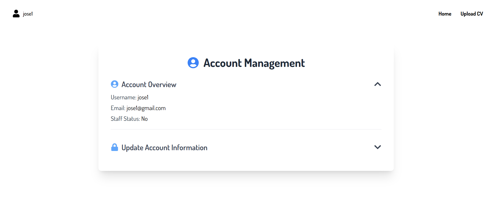
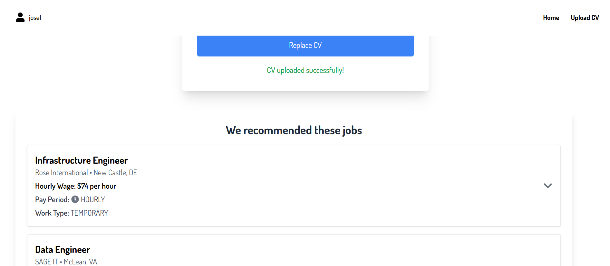

# Opportunext User Guide

## Table of Contents

1. [Introduction](#introduction)
2. [Getting Started – Creating an Account](#getting-started--creating-an-account)
3. [Navigating the Home Screen](#navigating-the-home-screen)
4. [Uploading Your CV](#uploading-your-cv)
5. [Searching for Jobs](#searching-for-jobs)
6. [Exploring Job Details](#exploring-job-details)
7. [Managing Your Account](#managing-your-account)
8. [Job Recommendations](#job-recommendations)
9. [Common Questions &amp; Answers](#common-questions--answers)
10. [Troubleshooting](#troubleshooting)

---

## Introduction

Opportunext is your all-in-one job discovery platform, designed to help you easily find and explore new career opportunities. Whether you’re a recent graduate or a seasoned professional, Opportunext provides personalized job recommendations and a streamlined search experience.

### Key Features

- **User-Friendly Navigation** – Quickly find essential features with a clean interface.
- **CV Uploading** – Upload your CV (PDF only) for tailored job recommendations.
- **Job Search** – Filter and discover job postings that match your interests.
- **Personalized Recommendations** – Our advanced clustering algorithm ensures relevant opportunities are shown to you.
- **Account Management** – Easily manage your profile, credentials, and preferences.

<figcaption align="center"><strong>Figure 1:</strong> The Opportunext homepage with the main banner, inviting users to explore job opportunities.</figcaption>

<figcaption align="center"><strong>Figure 2:</strong> A concise explanation of what Opportunext does </figcaption>

---

## Getting Started – Creating an Account

### Step 1: Sign Up

1. **Visit the Sign-Up Page**
   - Navigate to the Opportunext website and click **Sign Up** in the top-right corner.
2. **Enter Your Details**
   - Provide a username, email address, and password.
   - Make sure your password is secure.
3. **Submit the Form**
   - Click **Sign Up** to complete the process. You should see a confirmation message upon successful registration.

<figcaption align="center"><strong>Figure 3:</strong> The Sign-Up form, requiring username, email, and password.</figcaption>

### Step 2: Logging In

1. **Go to the Login Page**
   - Click **Log In** (or “Login”) from the homepage or top navigation.
2. **Enter Your Credentials**
   - Type your username and password into the designated fields.
3. **Click Log In**
   - You will be redirected to your personal home screen if your credentials are correct.

<figcaption align="center"><strong>Figure 4:</strong> The Login form where existing users can enter their username and password.</figcaption>

---

## Navigating the Home Screen

Once logged in, the home screen provides easy access to all main features.

- **Navigation Bar**Quickly jump to **Home**, **Upload CV**, **Job Recommendations**, or your **Profile**.
- **User Dropdown**Click your profile icon to manage your account or log out.
- **Dynamic Content**
  Inspiring job-related images and messages appear, helping you stay motivated.

<figcaption align="center"><strong>Figure 5:</strong> The main page upon logging in, featuring a large banner and quick navigation links.</figcaption>

---

## Uploading Your CV

### How to Upload or Update Your CV

1. **Go to Upload CV**
   - Click **Upload CV** from the top navigation bar.
2. **Select Your File**
   - Click **Choose File** to browse for your CV.
   - **PDF format only** is accepted.
   - Uploading a new file will replace your previously uploaded CV.
3. **Confirm Upload**
   - Click **Upload CV**. You’ll see a success message if everything goes smoothly.

<figcaption align="center"><strong>Figure 6:</strong> The CV upload form, indicating a PDF-only restriction.</figcaption>

---

## Searching for Jobs

### Using the Job Search Feature

1. **Locate the Search Bar**
   - Prominently displayed on the homepage (and sometimes on other pages).
2. **Type Your Keywords**
   - For example, “software engineer” or “marketing manager.”
   - Relevant suggestions may appear as you type.
3. **Click Search**
   - View the job listings that match your query.

<figcaption align="center"><strong>Figure 7:</strong> The search bar with auto-suggestions when typing job titles.</figcaption>

### Viewing Search Results

After clicking **Search**, you’ll see a list of job postings relevant to your query.

<figcaption align="center"><strong>Figure 8:</strong> A collection of job postings matching your search criteria.</figcaption>

---

## Exploring Job Details

Click on any job title to see more information:

- **Job Title & Company** – Quickly identify the role and employer.
- **Location & Salary** – Includes city/state (or remote) and compensation details.
- **Work Type** – Full-time, part-time, contract, etc.
- **Job Description** – Click **View More** for an expanded overview of responsibilities.
- **Skills & Requirements** – A list of required or preferred skills.

<figcaption align="center"><strong>Figure 9:</strong> Detailed information for a specific job posting, including salary, work type, and description.</figcaption>

---

## Managing Your Account

1. **Access Account Management**
   - Click your profile icon and select **Manage Account**.
2. **Review Your Information**
   - Check your username, email address, and staff status (if applicable).
3. **Update Email or Password**
   - Enter a new email or password in the appropriate fields.
4. **Save Changes**
   - Click **Update Account** to confirm your modifications.

<figcaption align="center"><strong>Figure 10:</strong> Overview of account details, including username and email address.</figcaption>

<figcaption align="center"><strong>Figure 11:</strong> Fields for updating email address and password.</figcaption>

---

## Job Recommendations

Once your CV is uploaded, Opportunext’s recommendation engine will display jobs that closely match your profile.

- **We Recommended These Jobs**A dedicated section (or page) will appear with curated job postings.
- **k-medoids Clustering**This algorithm groups similar job postings, ensuring you see opportunities that match your CV’s skills and experience.
- **Load More**
  Click **Load More Jobs** to fetch additional recommendations.

<figcaption align="center"><strong>Figure 12:</strong> A personalized list of recommended jobs, powered by k-medoids clustering.</figcaption>

---

## Common Questions & Answers

1. **How do I update my CV?**Go to **Upload CV**, choose your new PDF, and click **Upload CV** to replace the old one.
2. **What file formats are accepted?**Currently, **PDF only**. Please convert your résumé to PDF before uploading.
3. **How does the job recommendation system work?**
   Opportunext uses a **k-medoids clustering algorithm** to group similar job postings and provide personalized recommendations based on your CV.

---

## Troubleshooting

### Tips for Resolving Common Issues

- **Login Problems**
  - Ensure correct username/password (case-sensitive).
- **CV Upload Errors**
  - Confirm you’re uploading a PDF within size limits.
- **Slow Searches**
  - Check your internet connection and try clearing your browser cache.
- **Other Bugs**
  - Refresh the page or try a different browser.

